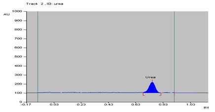
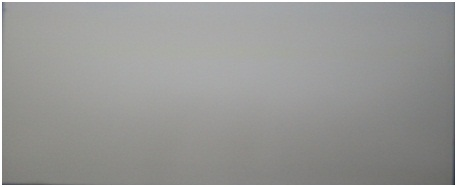
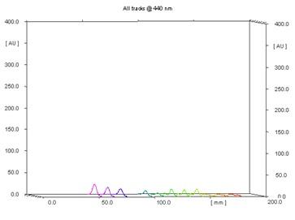
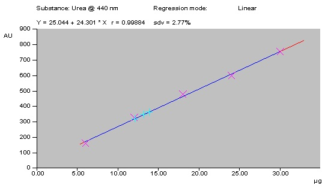

### Procedure

- A stock solution (3 mg/ml) of standard urea was prepared in water: MeOH (1:9) and sonicated for 10 minutes over an ultrasonic bath.
- The solution was filtered through Whatman No. 41 filter paper and filtrate was used as sample solution.
- A 20cm × 10cm HPTLC plate coated with silica gel 60 F 254 and alumina 60 F 254 (E. Merck, Darmstadt, Germany) was used for analysis.
- The samples were applied at 10 mm from the base of HPTLC plate by means of a Camag (Switzerland) Linomat V sample applicator using a syringe (100µL, Hamilton, Bonaduz, Switzerland).
- A linear calibration curve was obtained on applying the increasing concentration of standard urea in the range (5-30 µg).
- HPTLC analysis was performed on a computerized densitometer scanner 3, controlled by WinCATS planar chromatography manager version 1.4.4. (CAMAG, Switzerland).
- Plate was developed to a distance of 80 mm, in a Camag twin-trough chamber with mobile phase [n-propanol: Water:: 8:2 (v/v)].
- Plates were derivatized using Ehrlich's reagent.
- Plates were evaluated by densitometry at 440 nm with a Camag Scanner 3 for quantification.

### Observation

The chromatographic profile of the sample was simple, showing urea as the main component (Fig. 1). Urea is not UV active, so the plates were derivatized using the Ehrlich's reagent (Fig. 2). Peak of urea was identified using the solvent system [n-propanol: Water:: 8:2 (v/v)] with the Rf value of 0.74 ± 0.03 and there was no overlap with any other analyses of the sample at 440 nm (Fig. 3).

   
  <strong>Fig. 1: Chromatogram of standard urea</strong>
     
   
  <strong>Fig. 2: Derivatized image of urea</strong>
     
   
  <strong>Fig. 3: 3D display of urea peaks</strong>
    

The linearity of the proposed method was confirmed in the range of 5-30 µg of standard urea. A linear regression of the data points for standard urea is resulted in a calibration curve with the equation Y = 25.044 + 24.301x [regression coefficient (r2) = 0.99884, standard deviation (S.D.) = 2.77%] (Fig. 4). Urea content in milk samples were calculated and depicted in Table 1.

   
  <strong>Fig. 4: Calibration curve of urea</strong>
    
  <strong>Table 1: Urea content in milk</strong>
    

| Milk Samples (%) | Urea (%) | SD (%) |
|------------------|----------|--------|
| Pure Milk        | colspan="2" | 0 (naturally occurring) |
| Milk sample 1    | 02.16    | ± 0.50 |
| Milk sample 2    | 03.31    | ± 0.73 |
| Milk sample 3    | 04.48    | ± 0.82 |

The linearity, accuracy in terms of recovery % and precision was considered for the method. Validation of the method at three concentration levels was carried out by the standard recovery formula returned a mean of 92.24%. Precision (repeatability) was determined by running a minimum of four analyses and the coefficient of variability was found to be 2.892 %. The limit of detection (LOD) and quantification (LOQ) was found to be 0.37 and 1.13 µg respectively.
